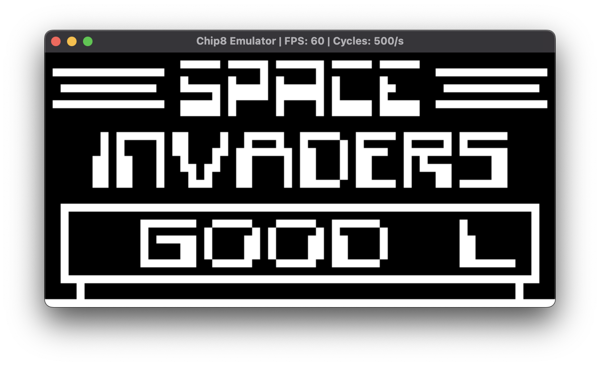
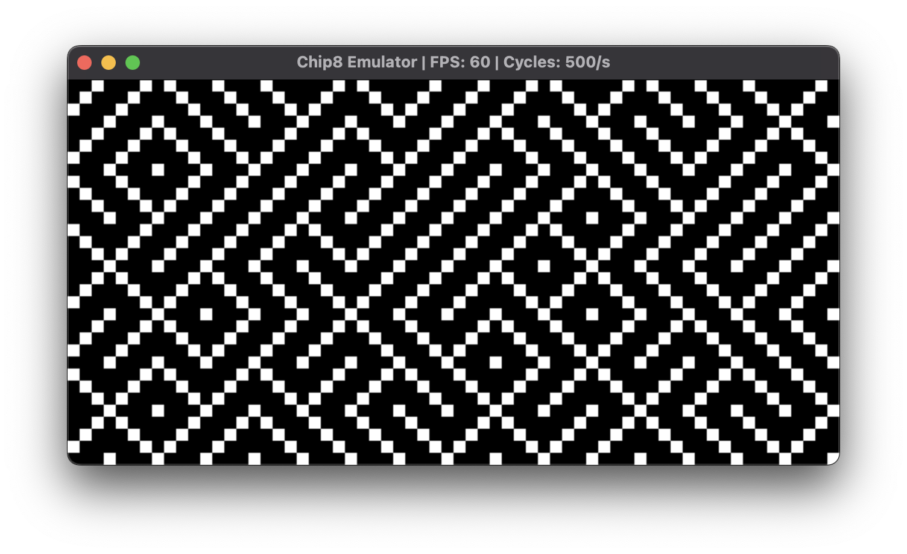
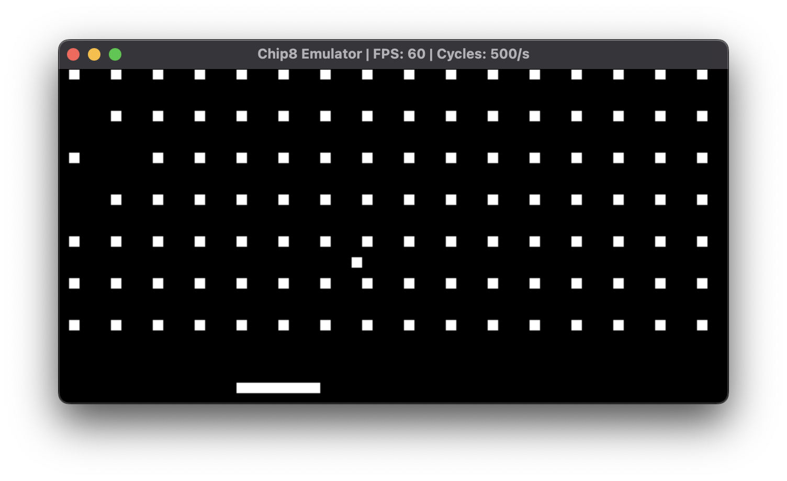
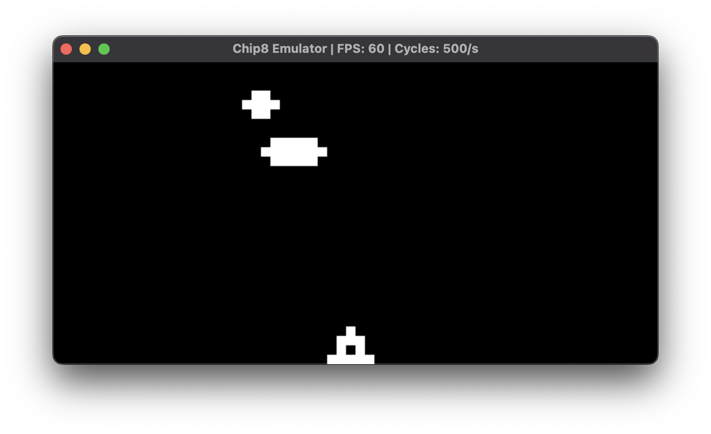
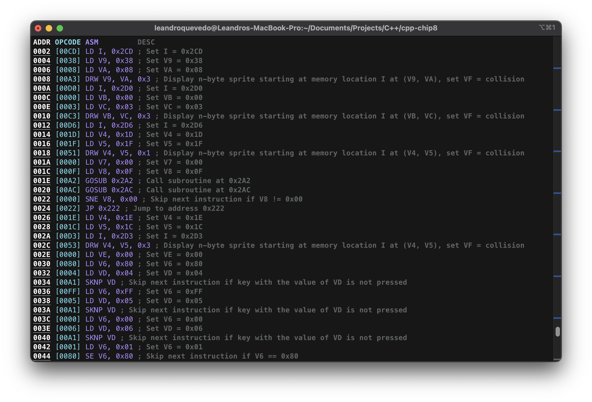
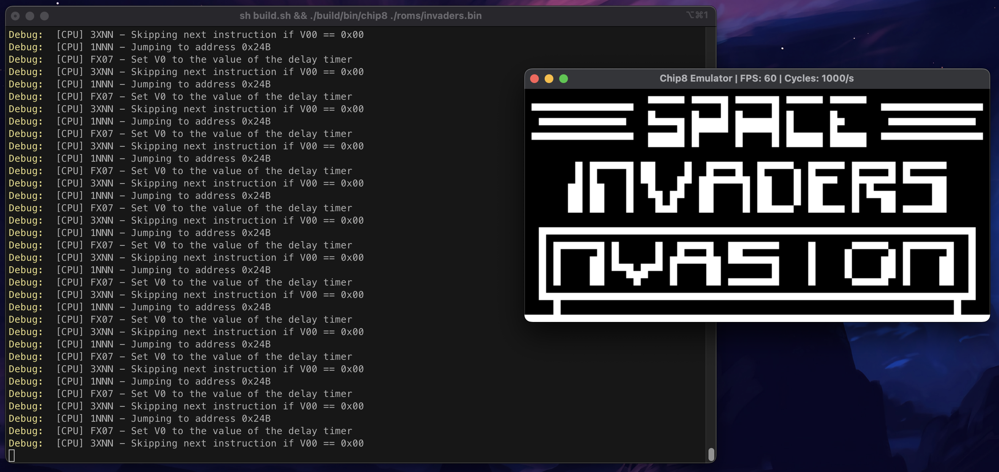

# CHIP8 Emulator/Interpreter
Yet another [CHIP8](https://en.wikipedia.org/wiki/CHIP-8) emulator/interpreter. Written in C++ using [SDL2](https://www.libsdl.org/) for graphics and input.

    
    
    
    

## Graphical User Interface

    

## How to run
### Linux/Mac
1. Install [Conan](https://conan.io/)
2. Install [CMake](https://cmake.org/)
3. Run `sh release.sh`
4. Run `./build/bin/chip8` passing the ROM file as argument
    1. Example: `./build/bin/chip8 'roms/invaders.bin'`

## Features
### Frame interpolation
Some games can present flickery graphics, this is due to the Graphic system on CHIP8 consistently XORing the video buffer + no synchronization support. To smooth out this effect the emulator provides double frame interpolation, which can be toggled by pressing `SPACE`.

    
    
     
    <small>Regular CHIP8 flickering vs Frame interpolated CHIP8 </small>

### Disassembler
The emulator provides a disassembler, which can be accessed by passing `--disassemble` as argument. This will print the disassembled code to the console and exit.

    

### LOG_VERBOSE mode

You can `#define LOG_VERBOSE` for extra debug information.
Which includes all the opcodes, their arguments and an explanation of what they do in real time, performance impact is negligible.

    

## Architecture
### Memory map
<pre align="left">
+-----------------------+
| 0x0050 - 0x01FF       | - Reserved memory (contains font set in emu)
+-----------------------+
| 0x0200 - 0x1000       | - Program ROM and work RAM
+-----------------------+
</pre>

### Input map
The CHIP-8 has a HEX based keypad (0x0-0xF), which maps to the following key-matrix:
<pre align="center">
╔═══╦═══╦═══╦═══╗                        ╔═══╦═══╦═══╦═══╗
║ 1 ║ 2 ║ 3 ║ C ║                        ║ 1 ║ 2 ║ 3 ║ 4 ║
╠═══╬═══╬═══╬═══╣                        ╠═══╬═══╬═══╬═══╣
║ 4 ║ 5 ║ 6 ║ D ║                        ║ q ║ w ║ e ║ r ║
╠═══╬═══╬═══╬═══╣  which translates to:  ╠═══╬═══╬═══╬═══╣
║ 7 ║ 8 ║ 9 ║ E ║   (in the keyboard)    ║ a ║ s ║ d ║ f ║
╠═══╬═══╬═══╬═══╣                        ╠═══╬═══╬═══╬═══╣
║ A ║ 0 ║ B ║ F ║                        ║ z ║ x ║ c ║ v ║
╚═══╩═══╩═══╩═══╝                        ╚═══╩═══╩═══╩═══╝
</pre>

### Audio
This emulator uses [SDL2](https://www.libsdl.org/) for audio. Generating a sine wave with a frequency of 440Hz for 1/60th of a second. This is the same frequency as the original CHIP-8.

### Instruction set

| Instruction | Description |
| -- | -- |
|0NNN|Not supported|
|00E0|Clear the screen|
|00EE|Return from a subroutine|
|1NNN|Jump to address NNN|
|2NNN|Execute subroutine starting at address NNN|
|3XNN|Skip the following instruction if the value of register VX equals NN|
|4XNN|Skip the following instruction if the value of register VX is not equal to NN|
|5XY0|Skip the following instruction if the value of register VX is equal to the value of register VY|
|6XNN|Store number NN in register VX|
|7XNN|Add the value NN to register VX|
|8XY0|Store the value of register VY in register VX|
|8XY1|Set VX to VX OR VY|
|8XY2|Set VX to VX AND VY|
|8XY3|Set VX to VX XOR VY|
|8XY4|Add the value of register VY to register VX.  Set VF to 01 if a carry occurs.  Set VF to 00 if a carry does not occur|
|8XY5|Subtract the value of register VY from register VX.  Set VF to 00 if a borrow occurs.  Set VF to 01 if a borrow does not occur|
|8XY6|Store the value of register VY shifted right one bit in register VX¹.  Set register VF to the least significant bit prior to the shift.  VY is unchanged|
|8XY7|Set register VX to the value of VY minus VX.  Set VF to 00 if a borrow occurs.  Set VF to 01 if a borrow does not occur|
|8XYE|Store the value of register VY shifted left one bit in register VX¹.  Set register VF to the most significant bit prior to the shift.  VY is unchanged|
|9XY0|Skip the following instruction if the value of register VX is not equal to the value of register VY|
|ANNN|Store memory address NNN in register I|
|BNNN|Jump to address NNN + V0|
|CXNN|Set VX to a random number with a mask of NN|
|DXYN|Draw a sprite at position VX, VY with N bytes of sprite data starting at the address stored in I.  Set VF to 01 if any set pixels are changed to unset, and 00 otherwise|
|EX9E|Skip the following instruction if the key corresponding to the hex value currently stored in register VX is pressed|
|EXA1|Skip the following instruction if the key corresponding to the hex value currently stored in register VX is not pressed|
|FX07|Store the current value of the delay timer in register VX|
|FX0A|Wait for a keypress and store the result in register VX|
|FX15|Set the delay timer to the value of register VX|
|FX18|Set the sound timer to the value of register VX|
|FX1E|Add the value stored in register VX to register I|
|FX29|Set I to the memory address of the sprite data corresponding to the hexadecimal digit stored in register VX|
|FX33|Store the binary-coded decimal equivalent of the value stored in register VX at addresses I, I + 1, and I + 2|
|FX55|Store the values of registers V0 to VX inclusive in memory starting at address I.  I is set to I + X + 1 after operation|
|FX65|Fill registers V0 to VX inclusive with the values stored in memory starting at address I.  I is set to I + X + 1 after operation|

## Roadmap

For when I have spare time:
- [x] Disassembler
- [x] Create a Graphical User Interface using Dear ImGui
  - [ ] Load ROM files within the GUI
  - [x] Implement a register view within the GUI
  - [x] Implement a stack view within the GUI
  - [x] Implement a dissasembler view within the GUI
  - [x] Implement a memory view within the GUI
  - [x] Implement a keypad view within the GUI
  - [x] Implement a screen view within the GUI
  - [x] Implement a debug view within the GUI
  - [x] Implement a settings view within the GUI
    - [x] Define a CLOCK hz
    - [x] Define a Frame Rate hz
    - [ ] Define the screen size
    - [ ] Define the screen scale
    - [x] Define the screen color
    - [ ] Define the audio frequency

## References
| Name | Description |
| -- | -- |
| [Corax89's - CHIP8 Test room](https://github.com/corax89/chip8-test-rom) | Used for testing |
| [Zophar's domain - CHIP8 Game room pack](https://www.zophar.net/pdroms/chip8/chip-8-games-pack.html) | Used for rooms |
| [Austin Morlan's - CHIP8 Article](https://austinmorlan.com/posts/chip8_emulator/#16-8-bit-registers) | Used as reference |
| [Matt Mikolay's - CHIP8 Reference](https://github.com/mattmikolay/chip-8/wiki/) | Used as reference |
| [Wikipedia - CHIP8 Page](https://en.wikipedia.org/wiki/CHIP-8) | Used as reference |
| [faizilham's - CHIP8 Article](https://faizilham.github.io/revisiting-chip8) | Inspiration for the Frame interpolation feature |
| [fluentcpp.com - Warning article](https://www.fluentcpp.com/2019/08/30/how-to-disable-a-warning-in-cpp/) | Used to disable useless warnings due to macro conditions |
